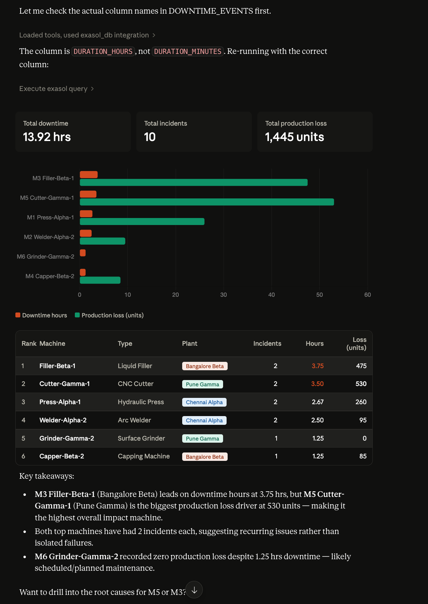
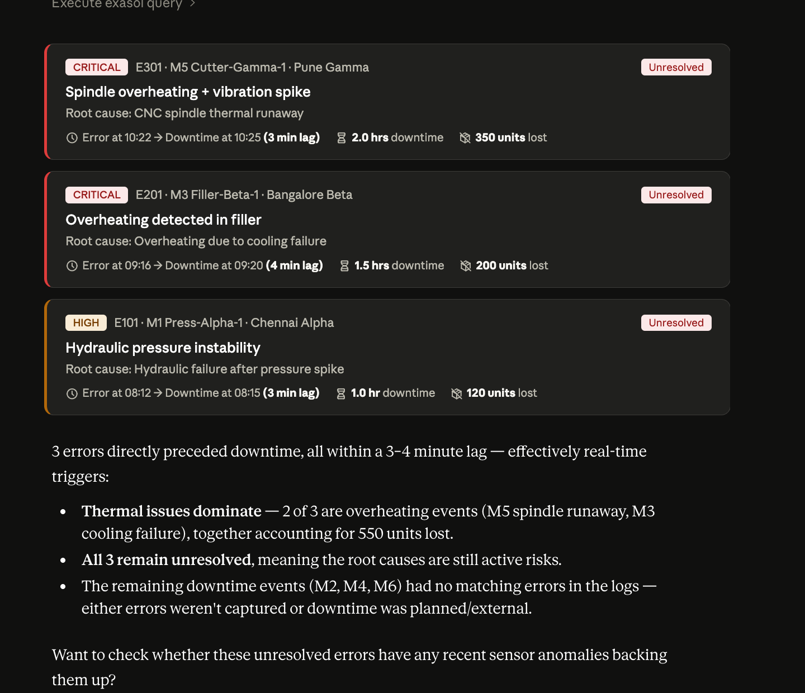
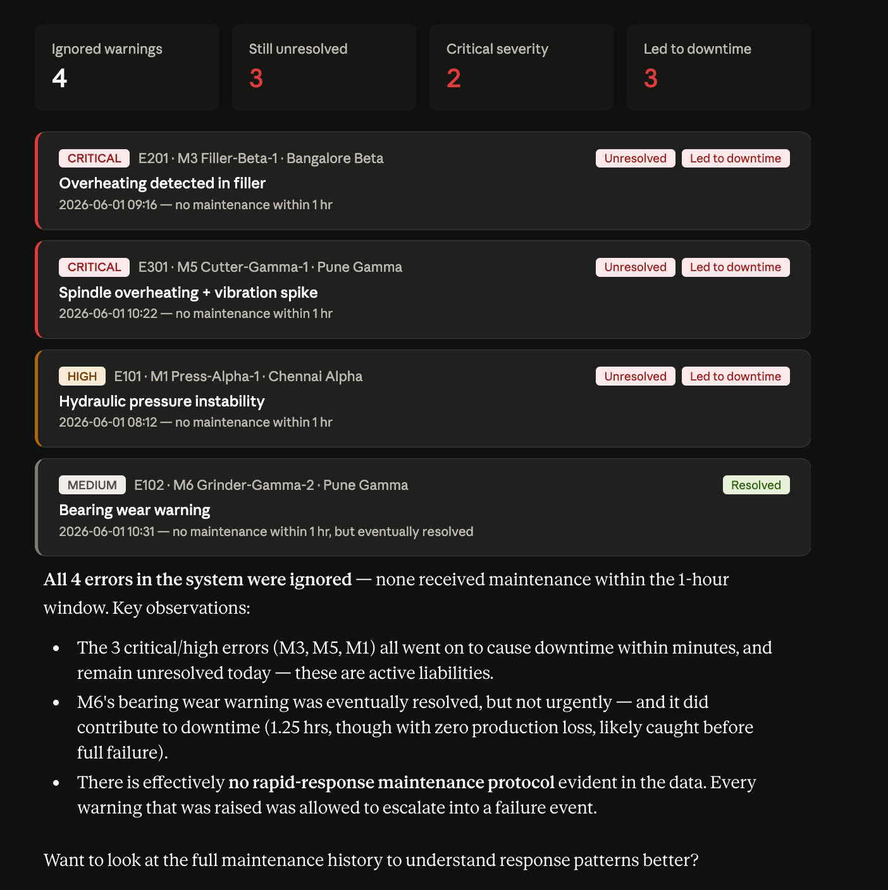
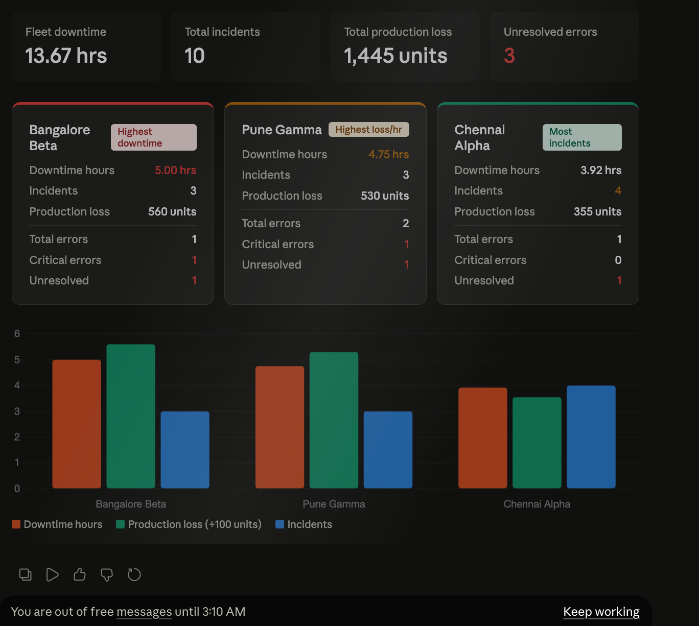

Used Sonnet 4.6 on Medium Thinking

## What are the machines with highest downtime impact?

## Which errors actually caused downtime

## “Ignored warnings” machines (error but no maintenance within 1 hour)

## Plant-wise failure intensity (best for dashboard)
