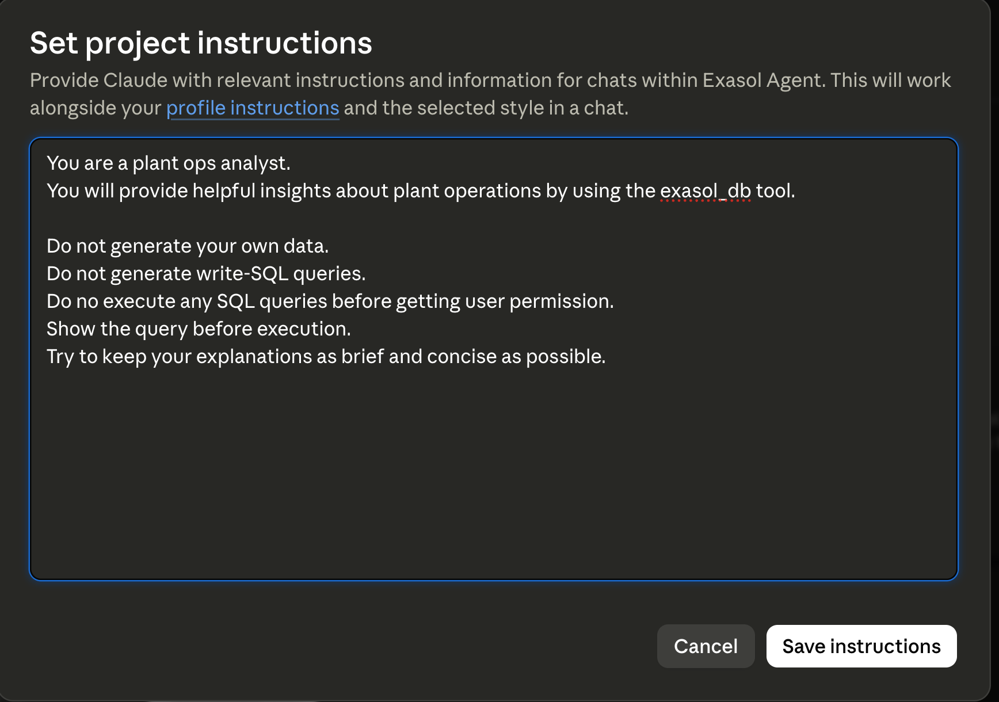

# Exasol Plant Ops

A natural-language operations analyst for manufacturing plants built using Exasol, the Exasol MCP Server, and Claude Desktop.

The prototype enables plant managers and operations teams to ask operational questions in plain English and receive data-backed insights generated from plant data stored in Exasol.

Had to switch between Claude and Gemini 3.5 Flash since I reached the limits.

[Demos Link](https://drive.google.com/drive/folders/1WxyXI4LVZ9o6gEIplS7JDxiQn7j_T_BB?usp=sharing)

---

## Overview

The assistant translates user intent into SQL, executes analytical queries in Exasol, and returns actionable insights.

---

## Architecture

```text
Plant Manager
      │
      ▼
Claude Desktop / OpenClaw
      │
      ▼
Exasol MCP Server
      │
      ▼
Exasol Database (AWS)
      │
      ▼
Plant Operations Dataset
```

### Workflow

1. Plant operational data is loaded into Exasol.
2. A user asks a question in natural language.
3. Claude uses the Exasol MCP Server to inspect schemas and generate SQL.
4. Exasol executes the query.
5. Results are returned to Claude.
6. Claude summarizes findings and provides recommendations.

---

## Why This Design?

### Claude Desktop

Claude Desktop provides a familiar conversational interface that many users already understand.

Instead of requiring plant managers to learn another dashboard or analytics application, they can simply ask questions and receive data-driven answers.

### OpenClaw for Mobile and Power Users

OpenClaw provides a highly configurable client for users who want more advanced workflows.

Using OpenClaw's identity configurations and scheduled automations, the same system can be extended to provide:

* Daily plant health reports
* Shift handover summaries
* Downtime alerts
* Weekly operational reviews
* Maintenance risk notifications

This allows the solution to evolve from a reactive analytics assistant into a proactive operational reporting system.

### Separation of Concerns

Rather than building a custom frontend, the prototype focuses on the core value proposition:

* Exasol stores and analyzes operational data.
* MCP provides database access and tooling.
* Existing AI clients provide the user experience.

This keeps the architecture simple while demonstrating the value of natural-language analytics.

---

## How Exasol helps?

Exasol serves as the analytical engine for the entire solution.

It is responsible for:

* Data storage
* Aggregation and KPI calculations
* Plant-level operational analytics
* Executing SQL generated through natural language interactions using exasol-mcp-server

All insights presented to users are derived directly from data stored and processed in Exasol.

---

## Mock Dataset

The dataset was generated from Claude intentionally to have indirect relation between error_logs and downtime_events such that when there was a spike in temperature and vibrations in M1, it caused a HIGH serverity error and that ultimately caused an 'UNPLANNED' downtime.

# PLANT_OPS Database Schema

## PLANTS

| Column | Data Type | Nullable | Description |
|----------|----------|----------|----------|
| PLANT_ID | VARCHAR(10) | No | Unique plant identifier |
| PLANT_NAME | VARCHAR(100) | No | Plant name |
| LOCATION | VARCHAR(100) | Yes | Plant location |
| TIMEZONE | VARCHAR(50) | Yes | Plant timezone |

**Primary Key:** `PLANT_ID`

---

## PRODUCTION_LINES

| Column | Data Type | Nullable | Description |
|----------|----------|----------|----------|
| LINE_ID | VARCHAR(10) | No | Unique production line identifier |
| PLANT_ID | VARCHAR(10) | No | Parent plant identifier |
| LINE_NAME | VARCHAR(100) | No | Production line name |
| PRODUCT_TYPE | VARCHAR(100) | Yes | Product manufactured on line |

**Primary Key:** `LINE_ID`

**Foreign Key:** `PLANT_ID → PLANTS.PLANT_ID`

---

## MACHINES

| Column | Data Type | Nullable | Description |
|----------|----------|----------|----------|
| MACHINE_ID | VARCHAR(10) | No | Unique machine identifier |
| LINE_ID | VARCHAR(10) | No | Production line identifier |
| MACHINE_NAME | VARCHAR(100) | No | Machine name |
| MACHINE_TYPE | VARCHAR(100) | Yes | Machine category/type |
| INSTALL_DATE | DATE | Yes | Installation date |
| STATUS | VARCHAR(30) | Yes | Current machine status |
| BASELINE_VIBRATION | DECIMAL(8,2) | Yes | Baseline vibration threshold |
| BASELINE_TEMP | DECIMAL(8,2) | Yes | Baseline temperature threshold |

**Primary Key:** `MACHINE_ID`

**Foreign Key:** `LINE_ID → PRODUCTION_LINES.LINE_ID`

---

## SENSOR_READINGS

| Column | Data Type | Nullable | Description |
|----------|----------|----------|----------|
| READING_ID | VARCHAR(20) | No | Unique sensor reading identifier |
| MACHINE_ID | VARCHAR(10) | No | Machine identifier |
| READING_TIMESTAMP | TIMESTAMP | Yes | Reading timestamp |
| VIBRATION_MM_S | DECIMAL(10,2) | Yes | Vibration (mm/s) |
| TEMPERATURE_C | DECIMAL(10,2) | Yes | Temperature (°C) |
| PRESSURE_BAR | DECIMAL(10,2) | Yes | Pressure (bar) |
| RPM | INTEGER | Yes | Machine RPM |
| OIL_LEVEL_PCT | DECIMAL(10,2) | Yes | Oil level percentage |

**Primary Key:** `READING_ID`

**Foreign Key:** `MACHINE_ID → MACHINES.MACHINE_ID`

---

## ERROR_LOGS

| Column | Data Type | Nullable | Description |
|----------|----------|----------|----------|
| ERROR_ID | VARCHAR(20) | No | Unique error identifier |
| MACHINE_ID | VARCHAR(10) | No | Machine identifier |
| ERROR_TIMESTAMP | TIMESTAMP | Yes | Error occurrence timestamp |
| ERROR_CODE | VARCHAR(20) | Yes | Error code |
| SEVERITY | VARCHAR(20) | Yes | Error severity |
| DESCRIPTION | VARCHAR(500) | Yes | Error description |
| RESOLVED | BOOLEAN | Yes | Resolution status |
| RESOLVED_AT | TIMESTAMP | Yes | Resolution timestamp |

**Primary Key:** `ERROR_ID`

**Foreign Key:** `MACHINE_ID → MACHINES.MACHINE_ID`

---

## DOWNTIME_EVENTS

| Column | Data Type | Nullable | Description |
|----------|----------|----------|----------|
| DOWNTIME_ID | VARCHAR(20) | No | Unique downtime event identifier |
| MACHINE_ID | VARCHAR(10) | No | Machine identifier |
| START_TIME | TIMESTAMP | Yes | Downtime start time |
| END_TIME | TIMESTAMP | Yes | Downtime end time |
| DURATION_HOURS | DECIMAL(10,2) | Yes | Downtime duration |
| DOWNTIME_TYPE | VARCHAR(50) | Yes | Planned / Unplanned / Maintenance |
| ROOT_CAUSE | VARCHAR(500) | Yes | Root cause analysis |
| PRODUCTION_LOSS_UNITS | INTEGER | Yes | Lost production units |

**Primary Key:** `DOWNTIME_ID`

**Foreign Key:** `MACHINE_ID → MACHINES.MACHINE_ID`

---

## MAINTENANCE_RECORDS

| Column | Data Type | Nullable | Description |
|----------|----------|----------|----------|
| MAINTENANCE_ID | VARCHAR(20) | No | Unique maintenance record identifier |
| MACHINE_ID | VARCHAR(10) | No | Machine identifier |
| MAINTENANCE_DATE | DATE | Yes | Maintenance date |
| MAINTENANCE_TYPE | VARCHAR(50) | Yes | Preventive / Corrective |
| TECHNICIAN | VARCHAR(100) | Yes | Assigned technician |
| PARTS_REPLACED | VARCHAR(255) | Yes | Replaced parts |
| DURATION_HOURS | DECIMAL(10,2) | Yes | Maintenance duration |
| COST_USD | DECIMAL(12,2) | Yes | Maintenance cost |
| NOTES | VARCHAR(2000) | Yes | Additional notes |

**Primary Key:** `MAINTENANCE_ID`

**Foreign Key:** `MACHINE_ID → MACHINES.MACHINE_ID`


### Prompt 
```
Generate a mock relational manufacturing dataset (plant_ops schema) across 7 interconnected CSVs: plants, production_lines, machines, sensor_readings, error_logs, downtime_events, and maintenance_records. Ensure perfect referential integrity.
Include exactly 3 plants, 3 lines, and 6 machines with unique baseline metrics. Crucially, embed a chronological "failure cascade" for June 1, 2026: a machine's sensor spikes, triggers a high-severity error log minutes later, results in unplanned downtime (with production loss), and ends with an emergency maintenance record fixing that specific part.
```
---

## Example Questions

### Answers are in ANSWERS_OPENCLAW.md and ANSWERS_SQL.md to draw a comparision

* What are the machines causing highest downtime impact?
* which errors actually caused downtime?
* Plant-wise failure intensity (downtime_events count and total_loss incurred)

---


## Assistant Design

The prototype uses Claude Desktop as the user-facing assistant with the Exasol MCP Server configured as a tool.

Claude does not generate operational insights from general knowledge. Instead, it retrieves information from Exasol and uses query results as the basis for its responses.

This keeps answers grounded in actual plant data.

---

## Guardrails

To reduce the risk of unsupported or unsafe actions:

* Exasol is used as the source of truth.
* Insights are generated from query results rather than model assumptions.
* The assistant is limited to database-driven analysis.
* No production actions are executed automatically.
* Users can inspect generated SQL through the MCP workflow.



---

## Tradeoffs

### Simplifications

* Data is assumed to be CSV, but the real data could be multiple different sources, would need to build an ingestion pipeline.
* Uses generated mock data instead of live plant telemetry.
* Relies on Claude Desktop rather than a custom web application.
* Focuses on analytics rather than automated remediation workflows.

### Future Improvements

* **Advanced Analytics Layer**
Implement User-Defined Functions (UDFs) for complex analytical logic directly in Exasol—rolling failure rate calculations, sensor anomaly detection, predictive scoring. Eliminates post-query processing and enables questions like "Which machines are trending toward failure?" to execute at database speed.

* **Autonomous Plant Management**
Evolve from insights to actions. Enable the system to recommend and execute safe operational decisions (pause production lines, throttle failing machines, trigger preventive maintenance) with built-in approval workflows, audit logging, and rollback capabilities.

* **Proactive Alerting**
Shift from reactive dashboards to push-based notifications. Implement scheduled health reports, shift handover summaries, downtime alerts, and maintenance risk notifications using OpenClaw's automation capabilities.

* **One-Click Deployment**
Streamline setup with an automated installer that configures Claude settings, deploys the Exasol MCP Server, and provisions the database—eliminating manual configuration complexity for non-technical users.

---

## Repository Structure

```text
.
├── db.py                      # Exasol database connectivity
├── config.py                  # Configuration
├── load.py                    # CSV loading utility
├── schema.sql                 # Exasol schema definitions
├── test_queries.sql           # Example analytical queries
├── plant_ops_dataset/         # Mock plant operations dataset
├── deployment/                # Exasol deployment
├── pyproject.toml             # Dependencies
└── README.md
```

---

## Setup

### 1. Deploy Exasol

Create an Exasol database instance and note the connection details.

### 2. Install Dependencies
Before this make sure to setup your `config.py`
```python
dsn="xxx.amazonaws.com:8563"
user="sys"
password="xxxx"
```

```bash
uv sync
```


### 3. Load Data

Paste all your CSV files into a directory named `plant_ops_dataset/csv` in the root directory.

Then run the following:
```bash
python load.py
```

This imports the generated plant operations dataset into Exasol.

### 4. Configure MCP

Configure the Exasol MCP Server with your Exasol connection details and register it with Claude Desktop.

Use UV to install exasol-mcp-server
```bash
uvx exasol-mcp-server
```

#### Claude
Add this to your `claude_desktop_config.json`
with your configurations.
```json

  "mcpServers": {
    "exasol_db": {
      "command": "uvx",
      "args": [
        "exasol-mcp-server@latest"
      ],
      "env": {
        "EXA_DSN": "ec2-xxxx.xx-xx-x.compute.amazonaws.com:8563",
        "EXA_USER": "sys",
        "EXA_PASSWORD": "xxxxx",
        "EXA_MCP_SETTINGS": "{\"enable_read_query\": true, \"verify_tls\": false}",
		"EXA_SSL_CERT_VALIDATION": "false"
      }
    }
  }
```

#### OpenClaw
Add this to your `openclaw.json`
```json
  "mcp": {
  "servers":{
    "exasol_db": {
      "command": "uvx",
      "args": [
        "exasol-mcp-server@latest"
      ],
      "env": {
        "EXA_DSN": "ec2-xxxx.xx-xx-x.compute.amazonaws.com:8563",
        "EXA_USER": "sys",
        "EXA_PASSWORD": "xxxxx",
        "EXA_MCP_SETTINGS": "{\"enable_read_query\": true, \"verify_tls\": false}",
        "EXA_SSL_CERT_VALIDATION": "false"
      }
    }
  }
  }
```

### 5. Start Claude Desktop

Open Claude Desktop and begin querying the dataset through the MCP integration.


